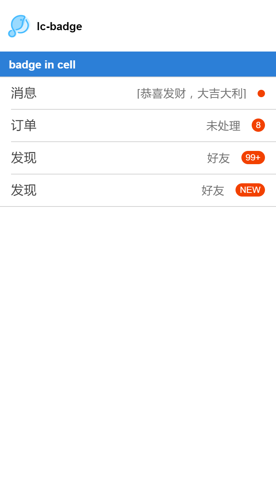

# lc-badge

> 徽标组件，可实现消息提醒等功能

### 规则
  - 一般集成在cell中或者底部导航栏，提醒用户有未处理消息
  
## [Demo](http://res.lightyy.com/lightui/example/badge/?_wx_tpl=http%3A%2F%2Fres.lightyy.com%2Flightui%2Fexample%2Fbadge%2Findex.native.js)




## 使用方法

```vue
<template>
  <div class="wxc-demo">
    <scroller>
      <title title="lc-badge"></title>

      <category title="badge in cell"></category>
      <lc-cell label="消息"
                title="[恭喜发财，大吉大利]"
                :link="link"
                :has-bottom-border="false"
                @LcCellClicked="LcCellClicked"
                :has-margin="false">
                  <lc-badge slot='value'></lc-badge>
      </lc-cell>
      <lc-cell label="订单"
                title="未处理"
                :link="link"
                :has-top-border="false"
                :has-bottom-border="false"
                @LcCellClicked="LcCellClicked"
                :has-margin="false">
                  <lc-badge text="8" slot='value'></lc-badge>
      </lc-cell>
      <lc-cell label="发现"
                title="好友"
                :link="link"
                :has-top-border="false"
                :has-bottom-border="false"
                @LcCellClicked="LcCellClicked"
                :has-margin="false">
                  <lc-badge text="99+" slot='value'></lc-badge>
      </lc-cell>
      <lc-cell label="发现"
                title="好友"
                :link="link"
                :has-top-border="false"
                @LcCellClicked="LcCellClicked"
                :has-margin="false">
                  <lc-badge text="NEW" slot='value'></lc-badge>
      </lc-cell>

    </scroller>
  </div>
</template>

<script>
  import { LcBadge, LcCell } from '../../index';
  import Title from '../_mods/title.vue';
  import Category from '../_mods/category.vue';

  export default {
    components: { Title, Category, LcBadge, LcCell  },
    methods:{
      LcCellClicked(){
        console.log('clicked');
      }
    }
  }
</script>

```

### API
| Prop | Type | Required | Default | Description |
| ---- |:----:|:---:|:-------:| :----------:|
| **`text`** | `string` | `N` | `-` | 徽标中的文字 |

- *1：没有传入文字，徽标是圆点样式。
- *2：单字符与多字符的徽标样式不同。
