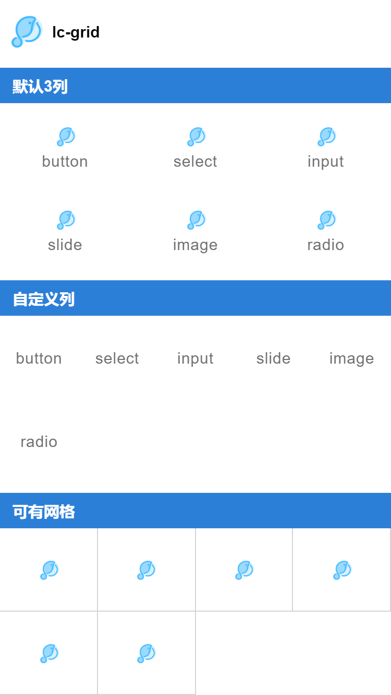

# lc-grid

> 利用网格组件可快速布局

### 规则
- 可自定义列的数量，默认为3列
- 网格内可插入图片和文字，并定义需要跳转的链接

## [Demo](http://res.lightyy.com/lightui/example/grid/?_wx_tpl=http%3A%2F%2Fres.lightyy.com%2Flightui%2Fexample%2Fgrid%2Findex.native.js)




## 使用方法

```vue
<template>
  <div class="wxc-demo">
    <scroller>
      <title title="lc-grid" @click="console"></title>
      <category title="默认3列"></category>
      <lc-grid :list="data"></lc-grid>

      <category title="自定义列"></category>
      <lc-grid :cols="5" :list="text"></lc-grid>

      <category title="可有网格"></category>
      <lc-grid :cols="4" :list="img" :border="true"></lc-grid>

    </scroller>
  </div>
</template>

<script>
  import { LcGrid } from '../../index';
  import Title from '../_mods/title.vue';
  import Category from '../_mods/category.vue';
  import {data, text, img} from './data.js';

  export default {
    components: { Title, Category, LcGrid },
    data(){
      return {
        data: data,
        text: text,
        img: img
      }
    },
    methods:{
      console(){
        console.log(this.data);
      }
    }
  }
</script>
```

> data.js
```javascript
let data = [
    {
        label:"button",
        icon: "https://i.loli.net/2017/12/19/5a387c4f536a1.png",
        path: "/index/button"
    },
    {
        label:"select",
        icon: "https://i.loli.net/2017/12/19/5a387c4f536a1.png",
        path: "/index/select"
    },
    {
        label:"input",
        icon: "https://i.loli.net/2017/12/19/5a387c4f536a1.png",
        path: "/index/input"
    },
    {
        label:"slide",
        icon: "https://i.loli.net/2017/12/19/5a387c4f536a1.png",
        path: "/index/slide"
    },
    {
        label: "image",
        icon: "https://i.loli.net/2017/12/19/5a387c4f536a1.png",
        path: "/index/image"
    },
    {
        label: "radio",
        icon: "https://i.loli.net/2017/12/19/5a387c4f536a1.png",
        path: "/index/radio"
    }
]
let text = [
    {
        label:"button",
        path: "/index/button"
    },
    {
        label:"select",
        path: "/index/select"
    },
    {
        label:"input",
        path: "/index/input"
    },
    {
        label:"slide",
        path: "/index/slide"
    },
    {
        label: "image",
        path: "/index/image"
    },
    {
        label: "radio",
        path: "/index/radio"
    }
]
let img = [
    {
        icon: "https://i.loli.net/2017/12/19/5a387c4f536a1.png",
        path: "/index/button"
    },
    {
        icon: "https://i.loli.net/2017/12/19/5a387c4f536a1.png",
        path: "/index/select"
    },
    {
        icon: "https://i.loli.net/2017/12/19/5a387c4f536a1.png",
        path: "/index/input"
    },
    {
        icon: "https://i.loli.net/2017/12/19/5a387c4f536a1.png",
        path: "/index/slide"
    },
    {
        icon: "https://i.loli.net/2017/12/19/5a387c4f536a1.png",
        path: "/index/image"
    },
    {
        icon: "https://i.loli.net/2017/12/19/5a387c4f536a1.png",
        path: "/index/radio"
    }
]
export {data, text, img};
```

### API
| Prop | Type | Required | Default | Description |
| ---- |:----:|:---:|:-------:| :----------:|
| **`cols`** | `Number` | `N` | `3` | 每行列数 |
| **`list`** | `Array` | `y` | `-` | 包含icon, label,path的数据 |

- * 点击每个item会触发`Light.navigate(path)`;