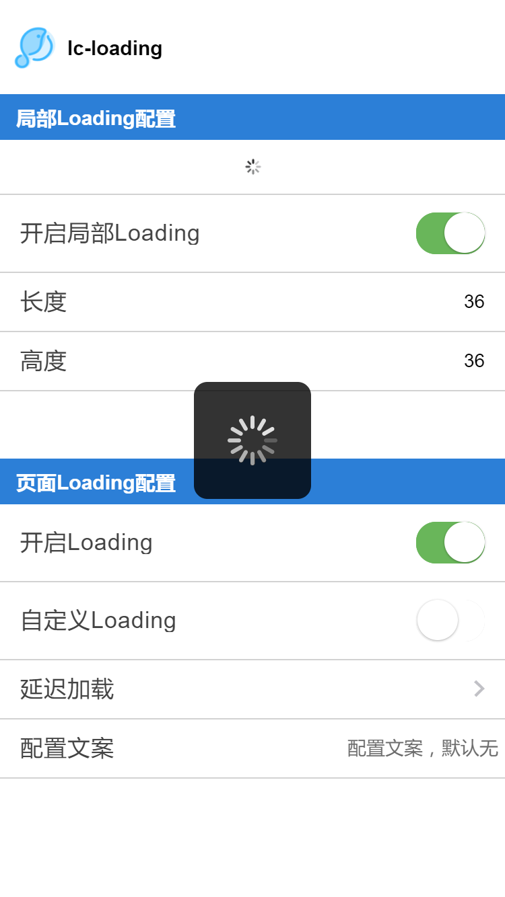

# lc-loading 

 > Weex 加载提示组件
 
### 规则
- 让用户知道页面正在加载
- 在某些特定场景下，提供有意义的文案，帮助用户明白哪个任务正在进行中
- 局部Loading不建议设置太大

## [Demo](http://res.lightyy.com/lightui/example/loading/?_wx_tpl=http%3A%2F%2Fres.lightyy.com%2Flightui%2Fexample%2Floading%2Findex.native.js)




## 使用方法

```vue
<template>
   <lc-loading :show="isShow" type="trip"></lc-loading>
   <lc-part-loading :show="isShow"></lc-part-loading>
</template>
<script>
    import { LcLoading, LcPartLoading } from 'weex-ui';
      components: { LcLoading, LcPartLoading },
      data () {
        return {
          isShow: true
        };
      }
    };
</script>
```

更详细代码可以参考 [demo](https://github.com/HS-Light/weex-ui/blob/light-ui/example/loading/index.vue)

### 可配置参数

#### 页面Loading

| Prop | Type | Required | Default | Description |
|-------------|------------|--------|-----|-----|
| show | `Bool` |`Y`| `false` | 是否显示|
| loading-text | `String` |`N`| `-` | 配置文案的显示 |
| **interval** | `Number` |`N`| `0` | 延迟毫秒数显示，用于体验优化|
| type | `String` | `N`|`default` |图案类别`default`/`fliggy`|

#### 局部Loading

| Prop | Type | Required | Default | Description |
|-------------|------------|--------|-----|-----|
| show | `Bool` |`Y`| `false` | 是否显示|
| width | `Number` |`N`| `36` | 局部加载的宽度 |
| height | `Number` |`N`| `36` | 局部加载的高度 |
