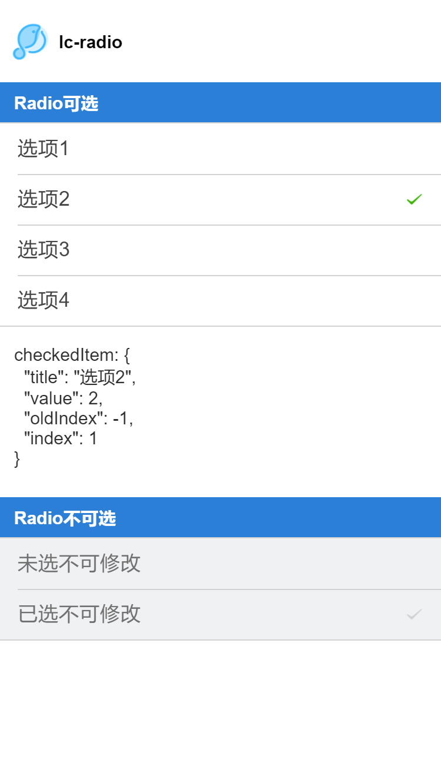

# lc-radio 

> Weex 单选组组件

## [Demo](http://res.lightyy.com/lightui/example/radio/?_wx_tpl=http%3A%2F%2Fres.lightyy.com%2Flightui%2Fexample%2Fradio%2Findex.native.js)




## 使用方法

```vue
<template>
  <div class="wxc-demo">
    <scroller class="scroller">
      <title title="lc-radio"></title>
      <category title="Radio可选"></category>
      <lc-radio :list="list"
                 @LcRadioListChecked="LcRadioListChecked"></lc-radio>
      <text class="radio-text">checkedItem: {{checkedInfo}}</text>
      <category title="Radio不可选"></category>
      <lc-radio :list="list2"></lc-radio>
    </scroller>
  </div>
</template>

<script>
  import Title from '../_mods/title.vue';
  import Category from '../_mods/category.vue';
  import { LcRadio } from '../../index';
  import { setTitle } from '../_mods/set-nav';

  export default {
    components: { Title, Category, LcRadio },
    data: () => ({
      list: [
        { title: '选项1', value: 1 },
        { title: '选项2', value: 2, checked: true },
        { title: '选项3', value: 3 },
        { title: '选项4', value: 4 }
      ],
      list2: [
        { title: '未选不可修改', value: 5, disabled: true },
        { title: '已选不可修改', value: 6, disabled: true, checked: true }
      ],
      checkedInfo: { title: '选项2', value: 2, oldIndex: -1, index: 1 }
    }),
    created () {
      setTitle('Radio');
    },
    methods: {
      LcRadioListChecked (e) {
        this.checkedInfo = e;
      }
    }
  }
</script>
```

### 可配置参数

| Prop | Type | Required | Default | Description |
| ---- |:----:|:---:|:-------:| :----------:|
| list | `Array` | `Y` | `[]` | Radio 列表配置(注1) |

#### 子item详细说明
| Prop | Type | Required | Default | Description |
| ---- |:----:|:---:|:-------:| :----------:|
| title | `String` | `Y` | `-` | Radio 显示 label |
| Value | `[String、Number、Object]` | `Y` | `-` | Radio 的 value |
| checked | `Boolean` | `N` | `false` | Radio 是否选中 |
| disabled | `Boolean` | `N` | `false` | Radio 是否不可选 |

注1: `list`
```
const list=[
        { title: '选项1', value: 1 },
        { title: '选项2', value: 2, checked: true },
        { title: '未选不可修改', value: 5, disabled: true },
        { title: '选项3', value: 3 },
        { title: '选项4', value: 4 }
      ];
```

### 事件回调

```
//点击事件回调 `@LcRadioListChecked="LcRadioListChecked"`
将会返回 e.value、e.title、e.oldIndex、e.index
```
