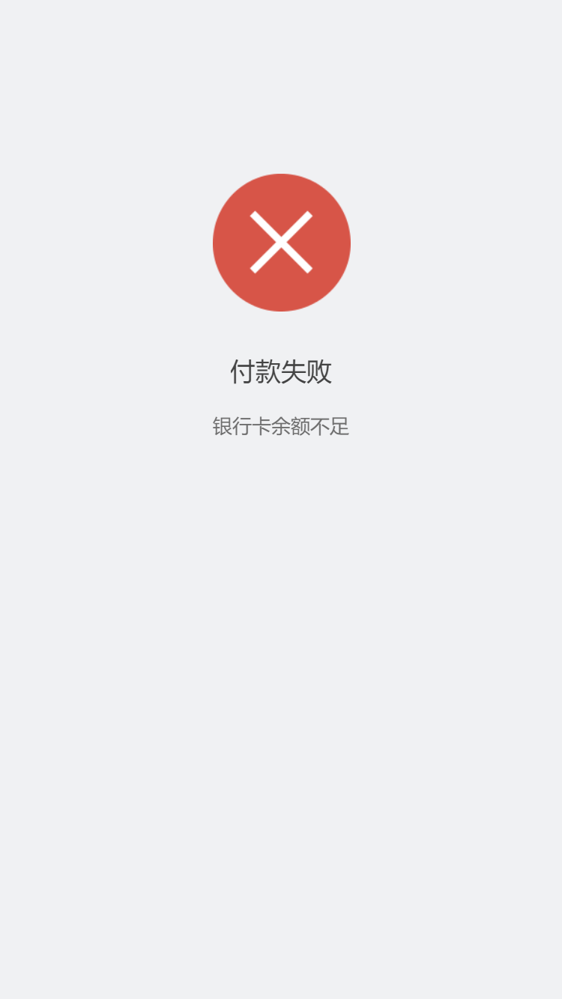

# lc-result 

> 结果页组件

### 规则
- 结果页可包含错误页面，操作成功提示页等多种类型
- 结果页可配置标题，描述与提示图片

## [Demo](http://res.lightyy.com/lightui/example/result/?_wx_tpl=http%3A%2F%2Fres.lightyy.com%2Flightui%2Fexample%2Fresult%2Findex.native.js)




## 使用方法

```vue
<template>
  <div class="wxc-demo">
    <lc-result :data="data"
                padding-top="232"
                @onResultClick="resultClicked"
                ></lc-result>
  </div>
</template>

<script>
  const modal = weex.requireModule('modal');

  import { LcResult } from '../../index';

  import { setTitle } from '../_mods/set-nav';
  import TYPE from './type.js'

  export default {
    components: { LcResult },
    data: () => ({
      data: {
            icon: 'https://i.imgur.com/hbN2Gux.png',
            desc: '付款成功，请耐心等待商品发货',
            title: '付款成功'
      } 
    }),
    created () {
      setTitle('Result');
    },
    methods: {
      resultClicked (e) {
        modal.toast({
          'message': e.title,
          'duration': 2
        })
      }
    }
  };
</script>

```

### API
| Prop | Type | Required | Default | Description |
| ---- |:----:|:---:|:-------:| :----------:|
| **`data`** | `Object` | `Y` | `-` | 结果页包含的标题，描述与图片 |

- * `data`中包含`title`,`desc`,`icon`;
